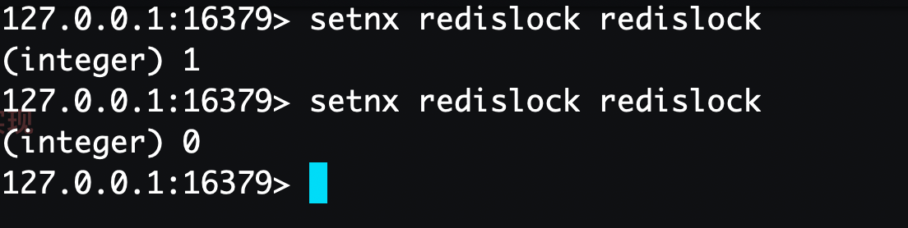

# redis_lock

## Example
### 1、通过composer包安装【推荐】
```
   composer require xiaobopang/redis_lock
```
PHP Redis分布式锁机制的简单实现


### 安全和可靠性保证

#### 在描述我们的设计之前，先提出三个属性，这三个属性是实现高效分布式锁的基础。

```
1、安全属性：互斥，不管任何时候，只有一个客户端能持有同一个锁。
2、效率属性A：不会死锁，最终一定会得到锁，就算一个持有锁的客户端宕掉或者发生网络分区。
3、效率属性B：容错，只要大多数Redis节点正常工作，客户端应该都能获取和释放锁。

```


### Redis命令介绍

```
使用Redis实现分布式锁，有两个重要函数需要介绍

SETNX命令（SET if Not eXists）
语法：
SETNX key value
功能：
当且仅当 key 不存在，将 key 的值设为 value ，并返回1；若给定的 key 已经存在，则 SETNX 不做任何动作，并返回0。

GETSET命令
语法：
GETSET key value
功能：
将给定 key 的值设为 value ，并返回 key 的旧值 (old value)，当 key 存在但不是字符串类型时，返回一个错误，当key不存在时，返回nil。

GET命令
语法：
GET key
功能：
返回 key 所关联的字符串值，如果 key 不存在那么返回特殊值 nil 。

DEL命令
语法：
DEL key [KEY …]
功能：
删除给定的一个或多个 key ,不存在的 key 会被忽略。

```

### 加锁实现


```
SETNX 可以直接加锁操作，比如说对某个关键词redislock加锁，客户端可以尝试

SETNX redislock timestamp

如果返回1，表示客户端已经获取锁，可以往下操作，操作完成后，通过 DEL redislock 命令来释放锁。

如果返回0，说明 redislock 已经被其他客户端上锁，如果锁是非堵塞的，可以选择返回调用。

如果是堵塞调用调用，就需要进入以下个重试循环，直至成功获得锁或者重试超时。理想是美好的，现实是残酷的。

仅仅使用SETNX加锁带有竞争条件的，在某些特定的情况会造成死锁错误。

```


### 时间戳的问题

```
我们看到redislock的value值为时间戳，所以要在多客户端情况下，保证锁有效，一定要同步各服务器的时间，如果各服务器间，时间有差异。

时间不一致的客户端，在判断锁超时，就会出现偏差，从而产生竞争条件。

锁的超时与否，严格依赖时间戳，时间戳本身也是有精度限制，假如我们的时间精度为秒，从加锁到执行操作再到解锁，一般操作肯定都能在一秒内完成。

这样的话，我们上面的例子，就很容易出现。所以，最好把时间精度提升到毫秒级。这样的话，可以保证毫秒级别的锁是安全的。

```

### 死锁问题

```
    在上面的处理方式中，如果获取锁的客户端端执行时间过长，进程被kill掉，或者因为其他异常崩溃，导致无法释放锁，就会造成死锁。
    
    所以，需要对加锁要做时效性检测。因此，我们在加锁时，把当前时间戳作为value存入此锁中，通过当前时间戳和Redis中的时间戳进行对比，

    如果超过一定差值，认为锁已经时效，防止锁无限期的锁下去，但是，在大并发情况，如果同时检测锁失效，并简单粗暴的删除死锁，再通过
    
    SETNX上锁，可能会导致竞争条件的产生，即多个客户端同时获取锁。

    T1获取锁，并崩溃。T2和T3调用SETNX上锁返回0后，获得redislock的时间戳，通过比对时间戳，发现锁超时。

    T2 向redislock发送DEL命令。

    T2 向redislock发送SETNX获取锁。

    T3 向redislock发送DEL命令，此时T3发送DEL时，其实DEL掉的是T2的锁。

    T3 向redislock发送SETNX获取锁。

    此时T2和T3都获取了锁，产生竞争条件，如果在更高并发的情况，可能会有更多客户端获取锁。
    
    所以，DEL锁的操作，不能直接使用在锁超时的情况下。

```


### 分布式锁的问题

```
1、必要的超时机制：获取锁的客户端一旦崩溃，一定要有过期机制，否则其他客户端都降无法获取锁，造成死锁问题。

2、分布式锁，多客户端的时间戳不能保证严格意义的一致性，所以在某些特定因素下，有可能存在锁串的情况。
要适度的机制，可以承受小概率的事件产生。

3、只对关键处理节点加锁，良好的习惯是，把相关的资源准备好，比如连接数据库后，调用加锁机制获取锁，
直接进行操作，然后释放，尽量减少持有锁的时间。

4、在持有锁期间要不要CHECK锁，如果需要严格依赖锁的状态，最好在关键步骤中做锁的CHECK检查机制，
但是根据我们的测试发现，在大并发时，每一次CHECK锁操作，都要消耗掉几个毫秒，而我们的整个持锁处理逻辑才不到10毫秒，
玩客没有选择做锁的检查。

5、sleep学问，为了减少对Redis的压力，获取锁尝试时，循环之间一定要做sleep操作。但是sleep时间是多少是门学问。
需要根据自己的Redis的QPS，加上持锁处理时间等进行合理计算。

```